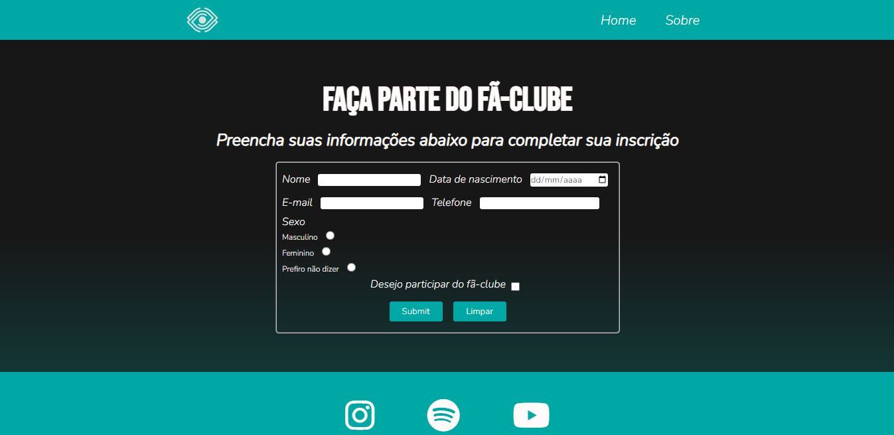

# Site fã-clube
## Projeto em andamento!

Atividade realizada na faculdade para reforçar os conhecimentos de HTML e CSS adquiridos, onde era possível escolher um artista, filme, jogo, série, etc, para construir um site dedicado ao fã-clube.

O assunto escolhido para o site foi a banda canadense de metal, Spiritbox.

