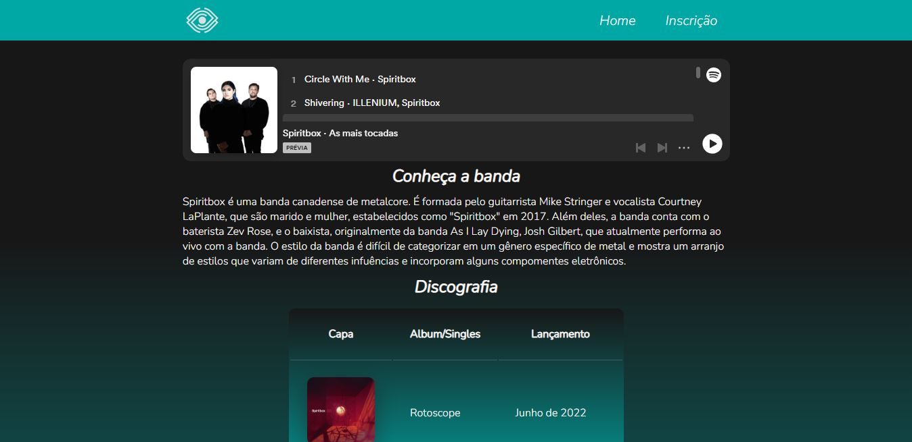

# Site fã-clube

Atividade realizada na faculdade para reforçar os conhecimentos de HTML e CSS adquiridos, onde era possível escolher um artista, filme, jogo, série, etc, para construir um site dedicado ao fã-clube.

